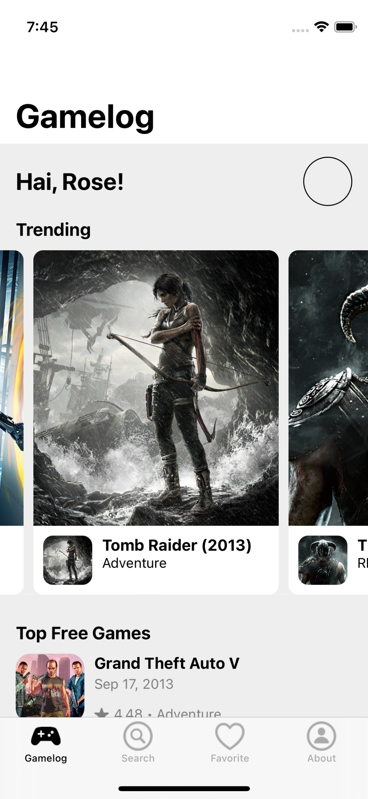
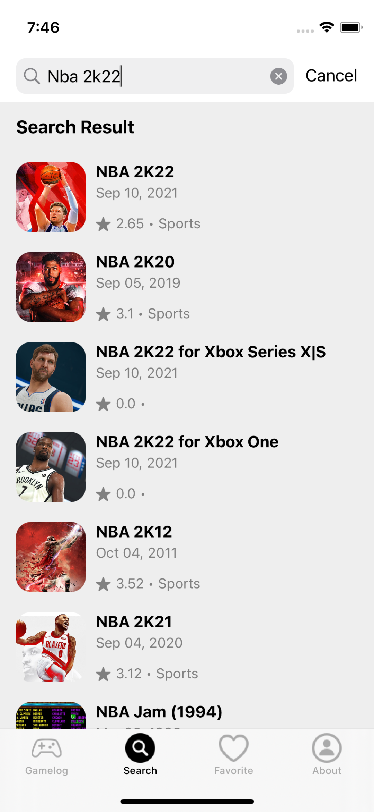
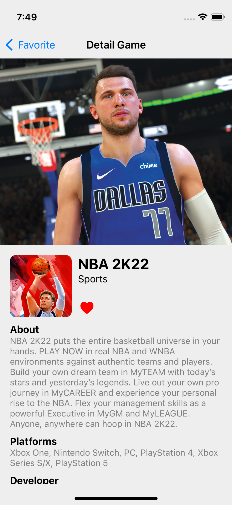

# Gamelog iOS App #
Gamelog is a game catalog application that can be used to find various kinds of information related to games ranging from pc games, xbox, playstation, mobile phones, etc. This application is also free for use by anyone. 

This app was made to complete a course on fundamental iOS App in Dicoding Indonesia.

### Screenshots ###
  

### Tech ###
* [Swift](https://developer.apple.com/swift/)
* [UIKit](https://developer.apple.com/documentation/uikit)
* [CoreData](https://developer.apple.com/documentation/coredata)
* [Alamofire](https://github.com/Alamofire/Alamofire)
* [Kingfisher](https://github.com/onevcat/Kingfisher)
* [Swiftlint](https://github.com/realm/SwiftLint)

### API ###
* [Games](https://rawg.io/apidocs)
